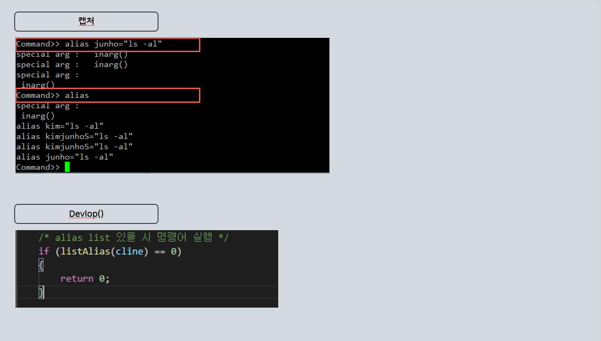

<h1>Linux_Project-Smallsh</h1>

리눅스 명령어와 파이프라인, 세마포어 등 리눅스 프로그래밍을 경험하고, 직접 커널에 연결하여 쉘을 구현하는 프로젝트입니다.

<h1>목차</h1>
<ul>
  <li>목적</li>
  <li>명령어 구현</li>
  <li>결과</li>
</ul>

<h1>목적</h1>

리눅스 명령어와 파이프라인, 세마포어 등 리눅스 프로그래밍을 경험하고, 직접 커널에 연결하여 쉘을 구현하는 프로젝트입니다.

오로지 학습용으로 봐주시면 감사하겠습니다.

<h1>명령어 구현</h1>
<ul>
  <li>ls</li>
  <li>redirection</li>
  <li>pipeline</li>
  <li>history</li>
  <li>alias</li>
  <li>cp</li>
  <li>clear</li>
  <li>chmod</li>
  <li>rm</li>
  <li>mv</li>
  <li>head</li>
  <li>tail</li>
  <li>...생략...</li>
</ul>

<h1>결과</h1>

